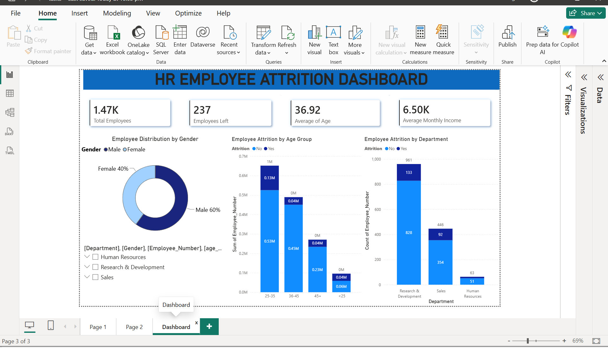
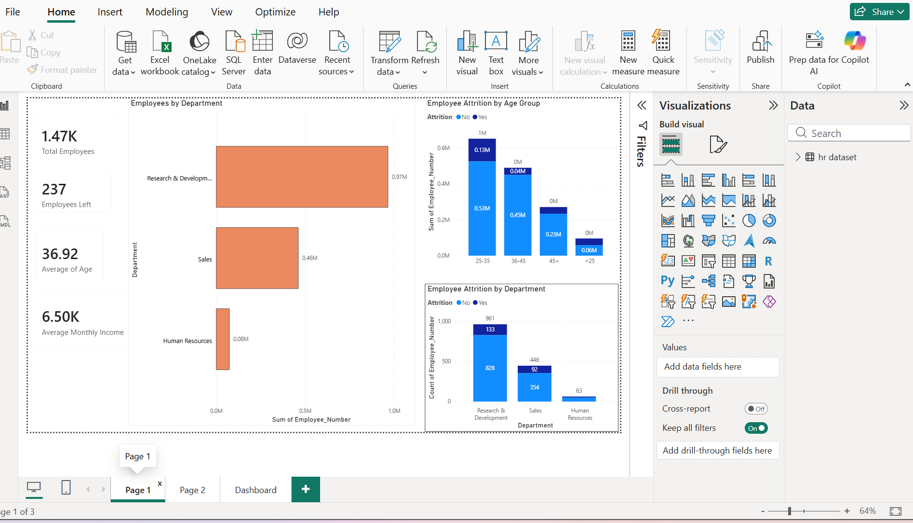
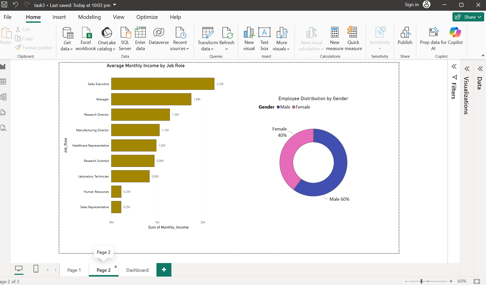

# SC_DA_03
Created an interactive dashboard in Power BI/Tableau using the HR Employee Attrition dataset. Built visualizations with filters for Department, Age Group, and Region to analyze employee attrition trends, identify key factors influencing resignations, and present actionable business insights.
# 📊 HR Employee Attrition Dashboard

## 📌 Project Overview

The dashboard provides valuable insights into employee attrition by analyzing various HR metrics such as department, age group, gender, job role, and monthly income. It helps organizations identify employee turnover patterns and supports data-driven HR decision-making.

---

## 🎯 Objective
Design an interactive dashboard that answers key business questions, including:

- Why are employees leaving?
- Which department has the highest attrition?
- Which age group experiences the most attrition?
- How does attrition vary by gender?
- Which job roles receive the highest monthly income?

---

## 📂 Dataset
**Dataset Used:** HR Employee Attrition Dataset

The dataset includes information such as:
- Employee ID
- Department
- Job Role
- Age
- Gender
- Monthly Income
- Attrition Status
- Employee Count

---

## 📈 Dashboard Features

### Page 1 - Department Analysis
- Total Employees
- Employees Left
- Average Age
- Average Monthly Income
- Employees by Department
- Employee Attrition by Age Group
- Employee Attrition by Department

### Page 2 - Job Role & Gender Analysis
- Average Monthly Income by Job Role
- Employee Distribution by Gender

### Dashboard Page
- Interactive KPI Cards
- Department Filter
- Gender Distribution
- Attrition by Age Group
- Attrition by Department
- Dynamic filtering for better analysis

---

## 🛠 Tools & Technologies
- Power BI
- Microsoft Excel
- Data Cleaning
- Data Visualization

---

## 📊 Key Insights
- Research & Development has the highest number of employees and attrition cases.
- Employees aged **25–35 years** show the highest attrition.
- Male employees represent around **60%** of the workforce.
- Sales Executives receive the highest total monthly income among job roles.
- HR department has the lowest employee count and attrition.

---

## 🚀 Skills Demonstrated
- Data Cleaning
- Data Transformation
- Dashboard Design
- KPI Creation
- Interactive Visualizations
- Business Insight Generation
- HR Analytics

---

## 📸 Dashboard Preview

### HR Employee Attrition Dashboard

### Department Analysis

### Job Role & Gender Analysis

---

## 📌 Conclusion
This dashboard enables HR teams to monitor workforce trends, understand employee attrition patterns, and make informed decisions using interactive visualizations and KPIs.

---
